# Intelligent Form Reader App Project Deep Blue

Most of the NGO’s run programs where the counsellor / filed workers have to visit remote rural areas or urban slum areas having very poor infrastructure and collect the required data based on their observation. They usually fill standard <strong>paper</strong> Later they manually enter data into the system. It’s a cumbersome process, especially if that data entered is handwritten by some other person.

The NGOs need a solution which would help take <strong>scanned images</strong> of the forms as <strong>input</strong> and capture the associated fields which are entered as handwritten (English block capital) text and numbers into <strong>electronic form</strong> to store the same.

The solution should be flexible to work for different kinds of forms even if the block capital letters and numbers are appearing at different positions for different forms.

## Problem Statement

The problem is to be able to build a software which will <strong>allow to set up of different types of forms</strong> in the system.

Based on the form which is set up, the solution needs to be able to recognise English Handwritten alphabets and numbers (block capitals) and store them as information.

There are a wide variety of OCR softwares in the market which allow to convert scanned images of documents into searchable text. These work well when the content in the image is in printed form. However this challenge looks at the <strong>ability to convert English handwritten (block capitals) alphabets and number</strong> from different kinds of forms and store them.

## Getting Started

* Once the project is cloned you need to import the Database from the DB folder into PHPmyadmin of your local machine.
* Place the Server Connections and APIs & OCR Web in the htdocs folder of your PHP localhost.
* Run the OCR Android Folder in Android Studio 2.0 or greater.
* Open the string.xml file of value folder in Android Studio and change the IP Address String to the IP Address of your Local Machine.
* Set up account on google cloud platform as well as you will also be required to give your billing details to set a billing account to avail the free service of Google Cloud Vision API. [Click Here](https://cloud.google.com/billing/docs/how-to/manage-billing-account) to know more.
* Once the billing account is set get credentials for Google Cloud Vision and put it in the GVision Vendor folder.
#### Note: 
Make sure your Android Phone and Local Machine are connected on same N/W.

### Prerequisites

* [Android Studio 2.0 or above](https://developer.android.com/studio/index.html)
* [XAMPP PHP 5.6 or above](https://www.apachefriends.org/download.html)
* Android Phone | Requirement : Lolipop 5.0 or above, Camera.

## Demo
### How to create template(Structure) of a form?
Capture Template           |Assigning Name to Template |Crop Template               |
:-------------------------:|:-------------------------:|:-------------------------:|
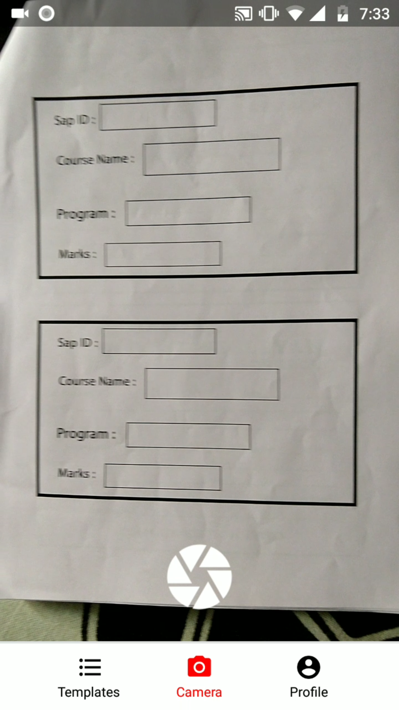  |  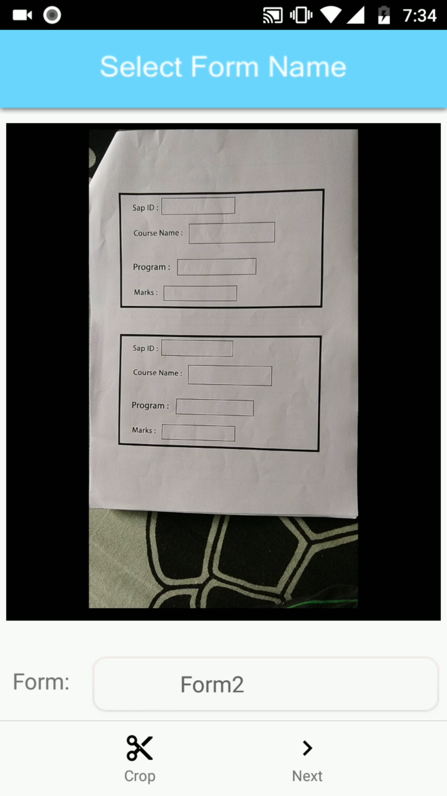  |  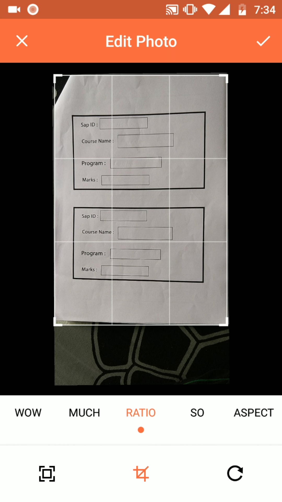  |

Select Field (By Touching) |Assign Name to Field       |Field Stored               |
:-------------------------:|:-------------------------:|:-------------------------:|
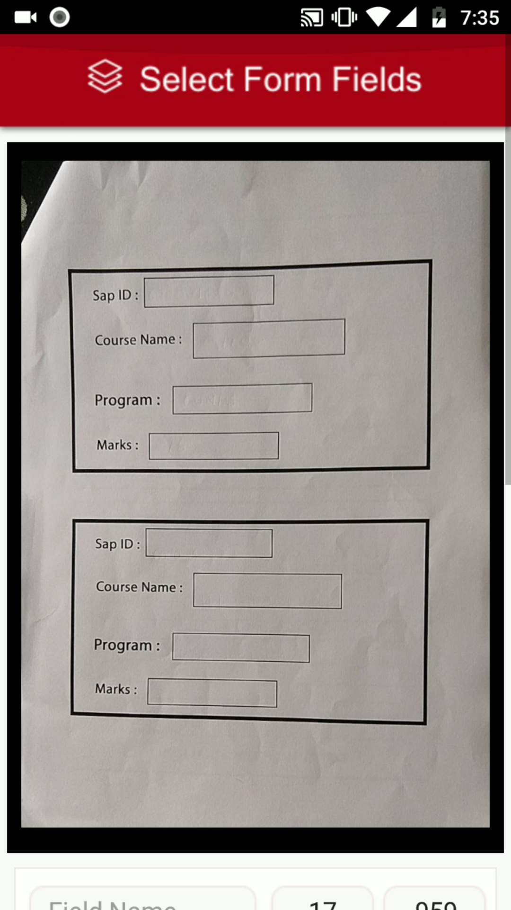  |  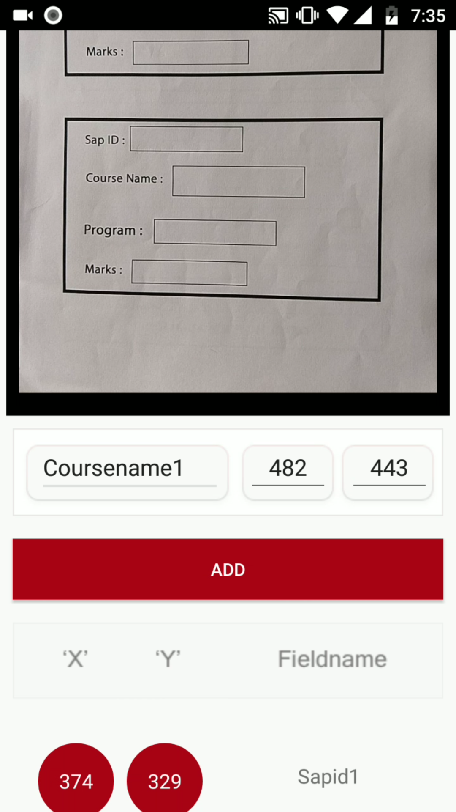  |  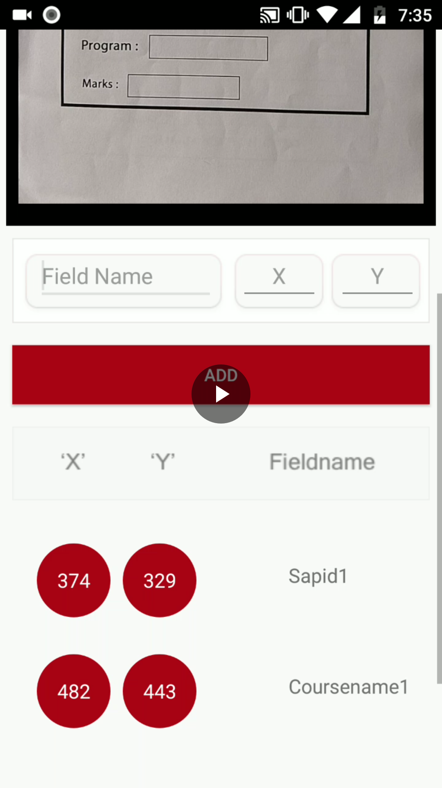  |

All Selected Field         |Template Stored            |
:-------------------------:|:-------------------------:|
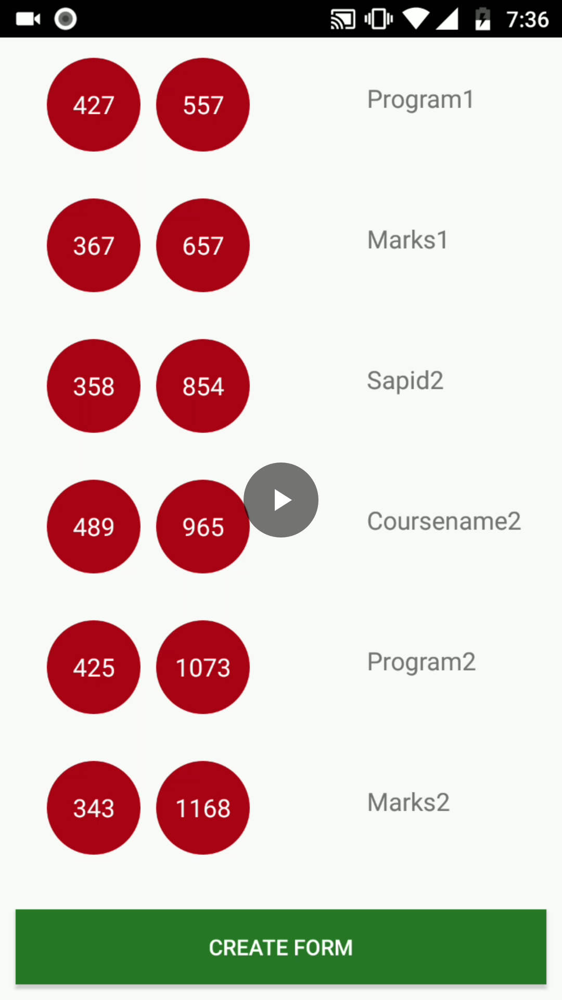  |  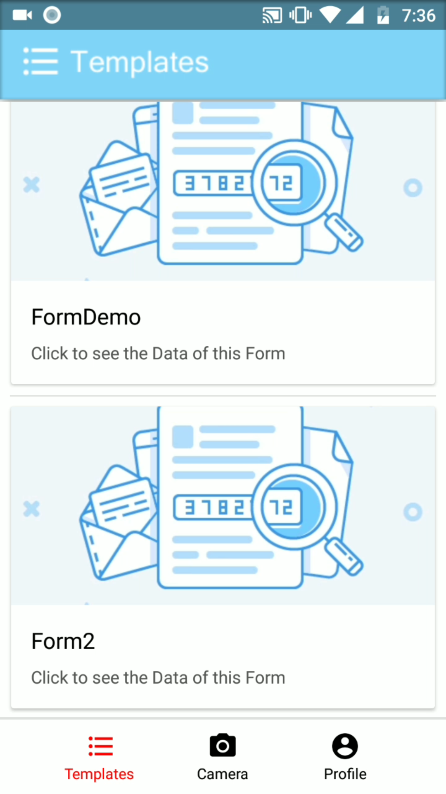  |

### How to extract details from a form (whose template is already created)? 
List of Templates          |Assigning Name to Form     |Croping Form               |
:-------------------------:|:-------------------------:|:-------------------------:|
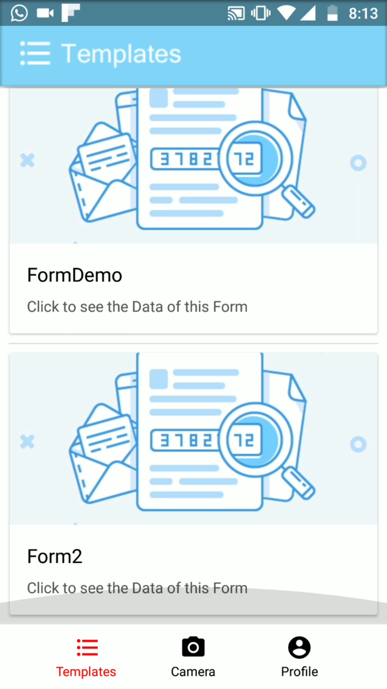  |  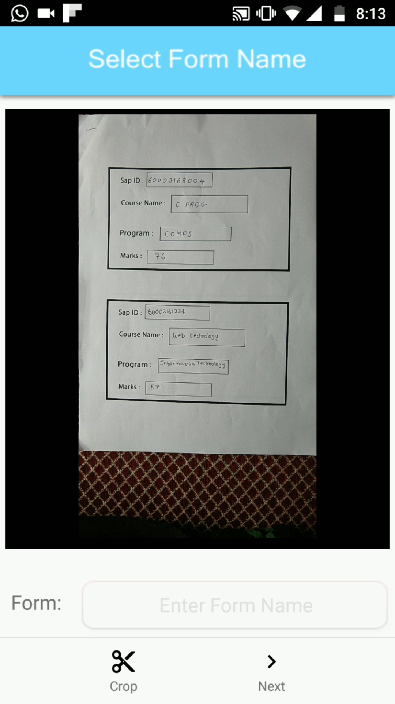  |  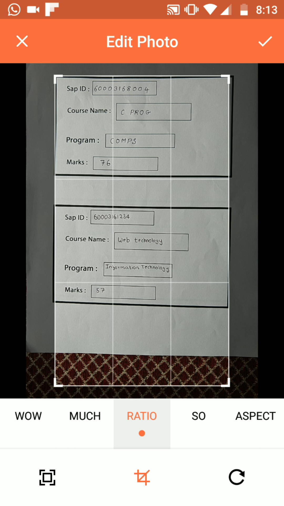  |

Extraction Result 1        |Extraction Result 2        |List of Form               |
:-------------------------:|:-------------------------:|:-------------------------:|
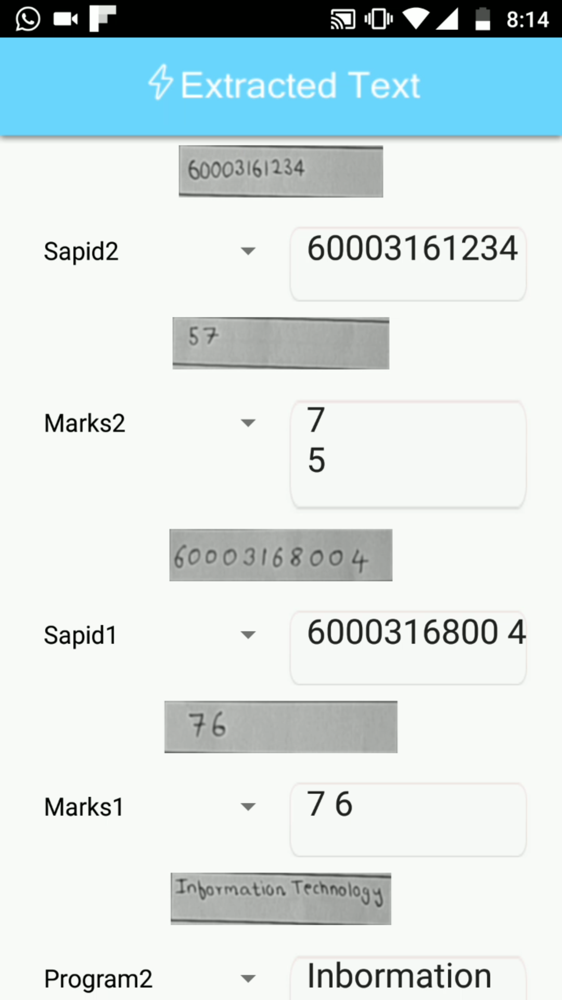  |  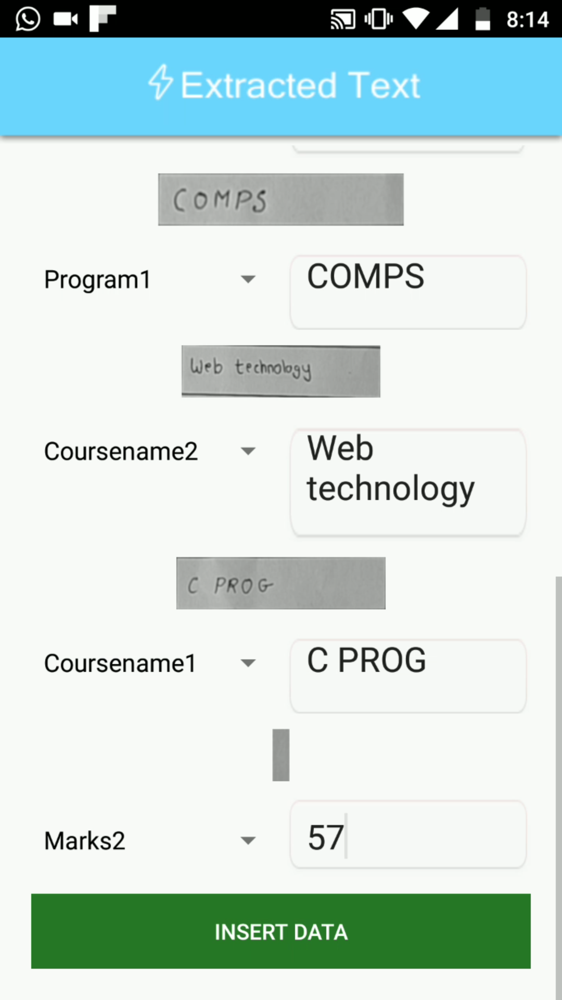  |  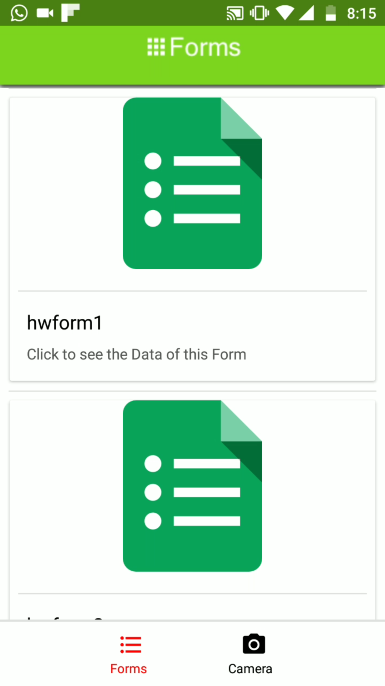  |

#### Note:
The System Supports sqaure shaped form fields to support more types of field modify the cropimage.py file in AndroidUploads/uploads/ Folder.

## Built With

* [Andrid Camera2 API](https://developer.android.com/reference/android/hardware/camera2/package-summary.html)
* [Google Cloud Vision](https://cloud.google.com/vision/) - Intelligent Text Recognition.
* [UCrop Library](https://github.com/Yalantis/uCrop) - Image Croping Library.

## Authors

* **Prathamesh Mhapsekar** - [prathmesh36](https://github.com/prathmesh36)
* **Mandar Mhapsekar** - [mandar10](https://github.com/mandar10)
* **Raj Patel** 
* **Aniket Mhatre**

See also the list of [contributors](https://github.com/your/project/contributors) who participated in this project.

## License

This project is licensed under the MIT License - see the [LICENSE.md](LICENSE.md) file for details

